<div align="center">


<a href="https://github.com/akashtcaa2005">
  
</a>
<a href="https://github.com/akashtcaa2005?tab=followers">
  
</a>


<br/><br/>


</div>

---

## 🧑‍💻 whoami

<table>
<tr>
<td width="45%" valign="top">


</td>
<td width="55%" valign="top">

```text
┌──────────────────────────────────────────────┐
│                  AKASH T.                    │
├──────────────────────────────────────────────┤
│ Role      : AI & ML Engineer                 │
│ Second     : Offensive Security Researcher   │
│ Focus     : AI • GenAI • RAG • Agents        │
│ Education : B.Tech AI & Data Science (2027)  │
│ Platforms : HackerOne • Bugcrowd             │
│ Mindset   : Learn → Build → Break → Ship     │
└──────────────────────────────────────────────┘
```

I build production-shaped AI systems by day, and I break production
web applications by night — two disciplines, one obsession: **understanding
systems well enough to make them do something they weren't designed to do.**

Not stopping at a notebook. Not stopping at a report. Shipping.

```text
Concept → Data → Model → API → App → Deploy → Monitor
Recon   → Enumerate → Exploit → Verify → Report → Payout
```

</td>
</tr>
</table>

---


## `$ boot_sequence --render`

<div align="center">
  
</div>

<p align="center"><sub>↑ this terminal actually types itself, line by line, forever. that's the point.</sub></p>

---

## ⚡ current mission

```text
AI Engineering    ████████████████████████████████████░░░░  90%
Machine Learning  ███████████████████████████████████░░░░░  85%
Generative AI     ████████████████████████████████████░░░░  90%
Offensive Sec     ██████████████████████████░░░░░░░░░░░░░░  65%
Cloud / MLOps     █████████████████████████░░░░░░░░░░░░░░░  60%
System Design     ████████████████████░░░░░░░░░░░░░░░░░░░░  45%
```

> **Mission:** become an engineer who can design, build, deploy and
> *defend* real-world AI systems — and an attacker good enough to know
> exactly where they'd break.

---

## 🧠 the ai / genai stack

```text
                 ┌──────────────────┐
                 │   AI ENGINEERING  │
                 └─────────┬─────────┘
                           │
        ┌──────────────────┼──────────────────┐
        ▼                  ▼                  ▼
   Machine Learning     Generative AI     Software Engineering
        │                  │                  │
        ▼                  ▼                  ▼
   Deep Learning         RAG + LLMs          Backend APIs
   Computer Vision       AI Agents           Databases
   Predictive Models     Tool Calling        Auth & Infra
        │                  │                  │
        └──────────────────┼──────────────────┘
                           ▼
                    PRODUCTION AI SYSTEM
```

<div align="center">

</div>

**Core:** Python • SQL &nbsp;|&nbsp; **ML:** Regression, Ensembles, XGBoost, Feature Engineering
**DL:** CNNs, Vision Transformers, Transfer Learning &nbsp;|&nbsp; **GenAI:** LLMs, RAG, Embeddings, Vector Search, AI Agents, Structured Outputs

---

## 🩻 offensive security lab

I approach security the way I approach ML — as a search problem: enumerate the
surface, find the signal, exploit the pattern.

<div align="center">
  
</div>

```text
Linux → Networking → Web Security → AuthN/AuthZ → API Security
     → Vulnerability Analysis → Recon Automation → AI-assisted Security
```

**Methodology:** recon automation → manual triage → exploitation → clean, reproducible reports
**Where it lives:** HackerOne & Bugcrowd submissions, custom Kali recon tooling, staging-environment research

<div align="center">

</div>

---

## 🌐 full-stack ai engineering

<div align="center">

</div>

<div align="center">

</div>

```text
Code → Git → GitHub → Test → Docker → Cloud → Deploy → Monitor → Iterate
```

# 🚀 flagship AI systems

<div align="center">

### `BUILDING AI SYSTEMS — FROM RAG TO AGENTIC INTELLIGENCE`

</div>

<table>
<tr>

<td width="50%" valign="top">

## 🧠 RAG Prediction Bot

**Retrieval-Augmented AI prediction system**

```text
User Input
    ↓
Query Understanding
    ↓
Knowledge Retrieval
    ↓
Vector Search
    ↓
Relevant Context
    ↓
Prediction Engine
    ↓
LLM Reasoning
    ↓
Evidence-Grounded Response
```

### Core capabilities

* 🔎 Retrieval-Augmented Generation
* 🧠 LLM-based reasoning
* 📚 Knowledge-base retrieval
* 🧩 Context-aware prediction
* 📊 Structured outputs
* 🔍 Evidence-grounded responses
* ⚙️ API-based AI architecture
* 📈 Evaluation-ready pipeline

### GenAI stack

`Python` `LLMs` `Embeddings` `Vector DB` `RAG` `FastAPI` `LLM APIs`

### Future evolution

```text
RAG
 ↓
Agentic RAG
 ↓
Tool Calling
 ↓
Memory
 ↓
Multi-Agent Workflow
 ↓
Autonomous Research Agent
```

</td>

<td width="50%" valign="top">

## 🧬 BioSence

**AI-powered health monitoring platform**

```text
User
 ↓
Health Data
 ↓
Signal Processing
 ↓
Personal Baseline
 ↓
Anomaly Detection
 ↓
Prediction
 ↓
RAG Knowledge Layer
 ↓
LLM Explanation
```

### Platform capabilities

* 🔐 Authentication
* 📱 Google OAuth
* 📲 Phone OTP
* 🚨 SOS workflow
* 📧 Alert system
* 🗄️ PostgreSQL
* ☁️ Supabase
* ⚛️ React + TypeScript

### Future AI layer

```text
Wearable Signals
       ↓
Preprocessing
       ↓
Feature Extraction
       ↓
Baseline Modeling
       ↓
Anomaly Detection
       ↓
Predictive Patterns
       ↓
RAG
       ↓
LLM Explanation
```

### Stack

`React` `TypeScript` `Supabase` `PostgreSQL` `Express` `RAG` `LLMs`

</td>

</tr>
</table>

---

# 🤖 advanced AI project portfolio

| Project                           | Category         | Core Technologies                          | AI Focus                     |
| --------------------------------- | ---------------- | ------------------------------------------ | ---------------------------- |
| 🧠 **RAG Prediction Bot**         | Generative AI    | Python · LLM · Embeddings · Vector DB      | RAG + Prediction + Reasoning |
| 🧬 **BioSence**                   | AI + Full Stack  | React · Supabase · PostgreSQL · RAG        | Health Intelligence          |
| 📈 **AI Data Science Platform**   | AI Engineering   | Python · Pandas · Scikit-learn · Streamlit | Automated ML + AI Insights   |
| 📚 **PDF/TXT RAG Pipeline**       | GenAI            | Python · Embeddings · LLMs                 | Document Intelligence        |
| 👁️ **Cats vs Dogs**              | Computer Vision  | Vision Transformers                        | Deep Learning                |
| 🧪 **ML Classification Suite**    | Machine Learning | Scikit-learn · Random Forest               | Predictive Modeling          |
| 🏠 **House Price Prediction**     | Machine Learning | Python · Regression                        | Regression                   |
| 👥 **Customer Behavior Analysis** | Data Science     | Pandas · ML                                | Behavioral Analytics         |
| ⚙️ **AI API Services**            | AI Engineering   | Flask · Python                             | Model Serving                |

---

# 🧠 project evolution

```text
                         AI PROJECTS
                              │
                              ▼
                    ┌──────────────────┐
                    │ MACHINE LEARNING │
                    └────────┬─────────┘
                             │
                             ▼
                    ┌──────────────────┐
                    │ DEEP LEARNING    │
                    └────────┬─────────┘
                             │
                             ▼
                    ┌──────────────────┐
                    │     LLMs         │
                    └────────┬─────────┘
                             │
                             ▼
                    ┌──────────────────┐
                    │       RAG        │
                    └────────┬─────────┘
                             │
                             ▼
                 ┌────────────────────────┐
                 │    RAG PREDICTION BOT  │
                 └────────────┬───────────┘
                              │
                              ▼
                     ┌────────────────┐
                     │  AGENTIC RAG   │
                     └───────┬────────┘
                             │
                             ▼
                     ┌────────────────┐
                     │  AI AGENTS     │
                     └───────┬────────┘
                             │
                             ▼
                    ┌──────────────────┐
                    │ MULTIMODAL AI    │
                    └────────┬─────────┘
                             │
                             ▼
                    ┌──────────────────┐
                    │ ADVANCED AI      │
                    │ SYSTEMS          │
                    └────────┬─────────┘
                             │
                             ▼
                    🔬 AI RESEARCH
```

---

# 🔬 next-generation project roadmap

## 01 — 🧠 RAG Prediction Bot

### Current

```text
Question
   ↓
Retrieve
   ↓
Context
   ↓
LLM
   ↓
Prediction
```

### Advanced

```text
Question
   ↓
Query Planner
   ↓
Multiple Retrieval Strategies
   ↓
Hybrid Search
   ↓
Reranking
   ↓
Evidence Verification
   ↓
Reasoning Model
   ↓
Prediction
   ↓
Confidence / Evaluation
   ↓
Final Response
```

### Future

```text
             ┌───────────────┐
             │ AI RESEARCHER │
             └───────┬───────┘
                     ↓
                Web Search
                     ↓
               Tool Calling
                     ↓
                  Memory
                     ↓
                Planning
                     ↓
                Reasoning
                     ↓
                Verification
                     ↓
             Autonomous Research
```

---

# 🧬 02 — BioSence Intelligence Layer

```text
              WEARABLE / USER DATA
                       │
                       ▼
                 DATA INGESTION
                       │
                       ▼
                SIGNAL PROCESSING
                       │
                       ▼
              FEATURE EXTRACTION
                       │
                       ▼
              PERSONAL BASELINES
                       │
             ┌─────────┴─────────┐
             ▼                   ▼
       ANOMALY MODEL       TREND MODEL
             │                   │
             └─────────┬─────────┘
                       ▼
                 RISK PATTERNS
                       │
                       ▼
                 KNOWLEDGE RAG
                       │
                       ▼
                 LLM EXPLANATION
                       │
                       ▼
                HUMAN-CENTERED UI
```

**Long-term direction:**

> Continuous data → personalized intelligence → grounded explanations → human decision support.

---

# 🤖 03 — autonomous research agent

### Future flagship project

```text
                    USER GOAL
                       │
                       ▼
                 TASK PLANNER
                       │
          ┌────────────┼────────────┐
          ▼            ▼            ▼
       SEARCH        ANALYZE      RETRIEVE
          │            │            │
          └────────────┼────────────┘
                       ▼
                 REASONING LOOP
                       │
                       ▼
                  VERIFICATION
                       │
                       ▼
                    MEMORY
                       │
                       ▼
                FINAL SYNTHESIS
                       │
                       ▼
                CITED REPORT
```

### Research areas

`Agents` `Planning` `Tool Use` `Memory` `RAG` `Reasoning` `Evaluation`

---

# 🌐 04 — multimodal intelligence system

```text
TEXT ───────┐
            │
IMAGE ──────┤
            ├──────► MULTIMODAL MODEL
AUDIO ──────┤
            │
VIDEO ──────┘
                    │
                    ▼
               UNDERSTANDING
                    │
                    ▼
                 REASONING
                    │
                    ▼
                 PLANNING
                    │
                    ▼
                 ACTION
```

Future exploration:

* Vision-Language Models
* Audio-Language Models
* Video understanding
* Multimodal RAG
* Cross-modal retrieval
* Vision agents
* Multimodal agents

---

# 🧠 2027 — ADVANCED GENAI ENGINEERING

```text
                         2027
                           │
          ┌────────────────┼────────────────┐
          ▼                ▼                ▼
       LLMs             AGENTS          MULTIMODAL
          │                │                │
          ▼                ▼                ▼
    Fine-tuning         Planning          Vision
    Distillation        Memory            Audio
    Inference           Tool Use          Video
    Optimization        MCP               VLMs
          │                │                │
          └────────────────┼────────────────┘
                           ▼
                      REASONING
                           │
                           ▼
                      VERIFICATION
                           │
                           ▼
                       PLANNING
                           │
                           ▼
                    AGENTIC SYSTEMS
                           │
                           ▼
                 ADVANCED AI SYSTEMS
```

---

# 🔬 beyond 2027 — AGI-oriented research

```text
GENAI
  ↓
AGENTIC AI
  ↓
REASONING
  ↓
MEMORY
  ↓
PLANNING
  ↓
MULTIMODAL INTELLIGENCE
  ↓
WORLD MODELS
  ↓
CONTINUAL LEARNING
  ↓
REINFORCEMENT LEARNING
  ↓
AI SAFETY + INTERPRETABILITY
  ↓
ADVANCED AI RESEARCH
  ↓
AGI-ORIENTED RESEARCH
```

### Long-term research interests

* 🧠 Reasoning architectures
* 🤖 Agentic intelligence
* 🧩 Memory architectures
* 🌐 Multimodal learning
* 🌍 World models
* 📚 Continual learning
* 🎯 Reinforcement learning
* 🔬 Foundation model research
* 🧪 AI evaluation
* 🛡️ AI safety
* 🔍 Interpretability
* ⚡ Efficient inference
* 🧠 Human-AI interaction

---


Building in public · MD
<!-- ═══════════ 🐍 BUILDING IN PUBLIC — paste this block into your README ═══════════ --> <div align="center"> <!-- twinkling animated banner -->  <!-- typing terminal --> <a href="https://github.com/akashtcaa2005">  </a>
<br/><br/>

<!-- animated pulse divider -->  </div> <br/> <!-- ═══════════ LIVE SCOREBOARD ═══════════ --> <div align="center">
⚡ Live Scoreboard
<a href="https://github.com/akashtcaa2005"> <picture> <source media="(prefers-color-scheme: dark)" srcset="https://github-readme-stats.vercel.app/api?username=akashtcaa2005&show_icons=true&include_all_commits=true&count_private=true&hide_border=true&theme=radical&rank_icon=github&cache_seconds=14400"> <source media="(prefers-color-scheme: light)" srcset="https://github-readme-stats.vercel.app/api?username=akashtcaa2005&show_icons=true&include_all_commits=true&count_private=true&hide_border=true&theme=default&title_color=0969da&icon_color=1a7f37&rank_icon=github&cache_seconds=14400">  </picture> </a> <a href="https://github.com/akashtcaa2005"> <picture> <source media="(prefers-color-scheme: dark)" srcset="https://github-readme-stats.vercel.app/api/top-langs/?username=akashtcaa2005&layout=donut-vertical&langs_count=8&hide_border=true&theme=radical&cache_seconds=14400"> <source media="(prefers-color-scheme: light)" srcset="https://github-readme-stats.vercel.app/api/top-langs/?username=akashtcaa2005&layout=donut-vertical&langs_count=8&hide_border=true&theme=default&title_color=0969da&cache_seconds=14400">  </picture> </a> <br/> <!-- streak with animated fire ring --> <a href="https://github.com/akashtcaa2005"> <picture> <source media="(prefers-color-scheme: dark)" srcset="https://streak-stats.demolab.com?user=akashtcaa2005&hide_border=true&theme=radical&stroke=00d9ff&ring=00ff9d&fire=ff6b35&currStreakLabel=00ff9d&date_format=j%20M%5B%20Y%5D"> <source media="(prefers-color-scheme: light)" srcset="https://streak-stats.demolab.com?user=akashtcaa2005&hide_border=true&theme=default&ring=0969da&fire=ff6b35&currStreakLabel=0969da&date_format=j%20M%5B%20Y%5D">  </picture> </a> </div> <br/> <!-- ═══════════ CONTRIBUTION PULSE ═══════════ --> <div align="center">
📈 Contribution Pulse
<picture> <source media="(prefers-color-scheme: dark)" srcset="https://github-readme-activity-graph.vercel.app/graph?username=akashtcaa2005&theme=react-dark&bg_color=00000000&color=00d9ff&line=00ff9d&point=ffffff&area=true&area_color=00d9ff&hide_border=true&custom_title=Commit%20Heartbeat"> <source media="(prefers-color-scheme: light)" srcset="https://github-readme-activity-graph.vercel.app/graph?username=akashtcaa2005&bg_color=ffffff&color=0969da&line=1a7f37&point=24292f&area=true&area_color=0969da&hide_border=true&custom_title=Commit%20Heartbeat">  </picture> </div> <br/> <!-- ═══════════ SNAKE ═══════════ --> <div align="center">
🐍 The Snake Is Hungry
<picture> <source media="(prefers-color-scheme: dark)" srcset="https://raw.githubusercontent.com/akashtcaa2005/akashtcaa2005/output/github-snake-dark.svg"> <source media="(prefers-color-scheme: light)" srcset="https://raw.githubusercontent.com/akashtcaa2005/akashtcaa2005/output/github-snake.svg">  </picture> </div> <br/> <!-- ═══════════ TROPHIES + FOOTER ═══════════ --> <div align="center">  <br/>  </div>


---

# 🌌 long-term vision

<div align="center">

```text
2026
 │
 ├── GENERATIVE AI ENGINEERING
 │
 ├── LLMs
 ├── RAG
 ├── AI AGENTS
 └── PRODUCTION GENAI
 │
 ▼
2027
 │
 ├── ADVANCED GENAI
 ├── REASONING
 ├── AGENTIC SYSTEMS
 ├── MULTIMODAL AI
 ├── MEMORY
 ├── WORLD MODELS
 └── AI INFRASTRUCTURE
 │
 ▼
2028+
 │
 ├── FOUNDATION MODEL RESEARCH
 ├── CONTINUAL LEARNING
 ├── REINFORCEMENT LEARNING
 ├── INTERPRETABILITY
 ├── AI SAFETY
 └── ADVANCED AI SYSTEMS
 │
 ▼
╔══════════════════════════════════════╗
║      AGI-ORIENTED RESEARCH          ║
╚══════════════════════════════════════╝
```

</div>

---

# 💡 engineering philosophy

<div align="center">

```text
╔══════════════════════════════════════════════════════╗
║                                                      ║
║              DON'T JUST USE AI.                     ║
║                                                      ║
║          UNDERSTAND IT. BUILD IT. TEST IT.           ║
║                                                      ║
║       BUILD → MEASURE → EXPERIMENT → LEARN           ║
║                  → IMPROVE → REPEAT                  ║
║                                                      ║
╚══════════════════════════════════════════════════════╝
```

### `Build intelligent systems. Study intelligence. Push the frontier.`

</div>

---

# 📫 reach me

<div align="center">

<a href="mailto:akashtcaa.2005@gmail.com">

</a>

<a href="https://linkedin.com/in/akash-t-845439314/">

</a>

<a href="https://github.com/akashtcaa2005">

</a>

</div>

<br>

<div align="center">


### ⚡ `Learn → Build → Evaluate → Research → Discover`

</div>

<div align="center">
  <a href="./ocean.svg" target="_blank" rel="noopener noreferrer">
    
  </a>
</div>
