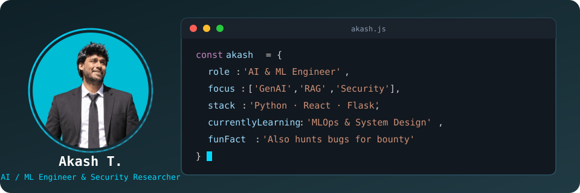

# ⚡ AKASH T.

<p align="center">
  
</p>

<p align="center">
  <a href="mailto:akashtcaa.2005@gmail.com"></a>
  <a href="https://linkedin.com/in/akash-t-845439314/"></a>
  <a href="https://github.com/akashtcaa2005"></a>
  <a href="https://github.com/akashtcaa2005"></a>
</p>

<p align="center">
  
</p>

---

## 🛠️ Technology Universe

**Programming**
<p></p>
Primary: Python • SQL — also working with Java, C/C++, JS/TS, R

**AI / Machine Learning**
<p></p>

- **ML:** Regression, Classification, Ensemble Learning, Random Forest, SVM, XGBoost, Feature Engineering, Hyperparameter Optimization
- **Deep Learning:** Neural Networks, CNNs, Vision Transformers, Transfer Learning, Computer Vision

**Generative AI**
LLMs • Prompt Engineering • RAG • Embeddings • Vector Databases • Semantic Search • AI Agents • Tool Calling • Structured Outputs
Tools: Hugging Face, LangChain, LLM APIs, RAG pipelines, Agent frameworks

**Data Science**
<p></p>
NumPy • Pandas • Matplotlib • Seaborn • Scikit-learn — data cleaning → EDA → feature engineering → modeling → evaluation → deployment

**Full-Stack**
<p>


</p>

**Cloud + DevOps**
<p></p>

**Cybersecurity**
Linux security • Networking • Web & API security • Authentication & authorization • Vulnerability analysis • Security automation • AI-assisted security

---

## 🚀 Featured Projects

### 🧬 BioSence — AI-Powered Health Monitoring Platform
`React + TypeScript` `Supabase` `PostgreSQL` `Express` `AI Integration`

Current: Auth (Google OAuth, Phone OTP), secure storage, SOS workflow, email notifications, API integrations, AI-assisted insights.
Planned intelligence layer: wearable data → signal processing → baseline generation → trend/anomaly detection → RAG → LLM explanation.

### 📈 AI Data Science Platform
An automated pipeline from raw dataset to ML insight: validation → auto-EDA → visualization → feature engineering → model training → evaluation → AI-generated insights → prediction.
`Python` `Pandas` `NumPy` `Scikit-learn` `Matplotlib` `Streamlit`

### 🧪 Machine Learning Portfolio

| Project                    | Area            | Technologies         |
| -------------------------- | --------------- | -------------------- |
| Iris Classification        | ML              | Python, Scikit-learn  |
| Wine Classification        | ML              | Random Forest         |
| House Price Prediction     | Regression      | Python, ML             |
| Customer Behavior Analysis | Data Science    | Pandas, ML             |
| Cats vs Dogs               | Computer Vision | ViT                    |
| PDF/TXT RAG                | GenAI           | Python, LLMs           |
| AI APIs                    | AI Engineering  | Flask                  |
| Health Monitoring          | AI + Full Stack | React, Supabase        |

---

## 🏆 Achievements

<div align="center">

| Achievement         | Result                         |
| ------------------- | ------------------------------ |
| 🥇 College Tech Day | **1st Prize**                  |
| 💰 Prize            | **₹10,000**                    |
| 💻 LeetCode         | **150+ Problems**              |
| 🗃️ HackerRank      | **Advanced SQL**               |
| 🎖️ Microsoft Learn | **25+ Badges / 2 Trophies**    |
| 🤖 Internships      | **AI / ML / GenAI Experience** |

</div>

---

## 📚 Learning Dashboard

```text
AI Engineering       ████████████████████░░  90%
Machine Learning     ███████████████████░░░  85%
Generative AI        ████████████████████░░  90%
Python               ████████████████████░░  90%
Data Science         ███████████████████░░░  85%
DSA                  ████████████████░░░░░░  75%
Cybersecurity        █████████████░░░░░░░░░  65%
Cloud / MLOps        ████████████░░░░░░░░░░  60%
System Design        █████████░░░░░░░░░░░░░  45%
```

*Progress indicators represent current learning focus, not formal proficiency ratings.*

---

## 🧑‍💻 Dev Environment

```bash
$ neofetch

OS           → Kali Linux
Shell        → Zsh
Editor       → VS Code
Language     → Python 3.11+
Containers   → Docker
Database     → MySQL / PostgreSQL / MongoDB
Frontend     → React + TypeScript
Backend      → Flask / Express
AI           → PyTorch / TensorFlow
GenAI        → Hugging Face / LLM APIs
Cloud        → AWS / GCP
```

---

## 🐍 Contribution Activity

<p align="center">

</p>

## 📊 GitHub Analytics

<p align="center">


</p>

<p align="center">

</p>

---

## 🎯 2026 → 2027 Roadmap

```text
2026
 ├── Advanced Python
 ├── Machine Learning / Deep Learning
 ├── Generative AI / RAG / AI Agents
 ├── DSA
 └── Cybersecurity
        ↓
2027
 ├── Production AI / MLOps
 ├── Cloud Architecture
 ├── System Design
 └── Large-Scale AI Applications
        ↓
   AI ENGINEER
```

---

## 🌟 What I Want to Build

AI systems that are **fast, reliable, explainable, secure, scalable, and useful** — real applications, real users, real engineering. Not just demos.

---

## 📫 Connect With Me

<p align="center">
<a href="mailto:akashtcaa.2005@gmail.com"></a>
<a href="https://linkedin.com/in/akash-t-845439314/"></a>
<a href="https://github.com/akashtcaa2005"></a>
</p>

<p align="center">

</p>

<p align="center">

### ⚡ Learn. Build. Break. Fix. Deploy. Repeat.

**AI • Machine Learning • Generative AI • Data Science • Cybersecurity**

</p>
