<div align="center">


<a href="https://github.com/akashtcaa2005">
  
</a>
<a href="https://github.com/akashtcaa2005?tab=followers">
  
</a>


<br/><br/>


</div>

---

## `$ boot_sequence --render`

<div align="center">
  
</div>

<p align="center"><sub>↑ this terminal actually types itself, line by line, forever. that's the point.</sub></p>

---

## 🧑‍💻 whoami

<table>
<tr>
<td width="45%" valign="top">


</td>
<td width="55%" valign="top">

```text
┌──────────────────────────────────────────────┐
│                  AKASH T.                    │
├──────────────────────────────────────────────┤
│ Role      : AI & ML Engineer                 │
│ Second     : Offensive Security Researcher   │
│ Focus     : AI • GenAI • RAG • Agents        │
│ Education : B.Tech AI & Data Science (2027)  │
│ Platforms : HackerOne • Bugcrowd             │
│ Mindset   : Learn → Build → Break → Ship     │
└──────────────────────────────────────────────┘
```

I build production-shaped AI systems by day, and I break production
web applications by night — two disciplines, one obsession: **understanding
systems well enough to make them do something they weren't designed to do.**

Not stopping at a notebook. Not stopping at a report. Shipping.

```text
Concept → Data → Model → API → App → Deploy → Monitor
Recon   → Enumerate → Exploit → Verify → Report → Payout
```

</td>
</tr>
</table>

---

## ⚡ current mission

```text
AI Engineering    ████████████████████████████████████░░░░  90%
Machine Learning  ███████████████████████████████████░░░░░  85%
Generative AI     ████████████████████████████████████░░░░  90%
Offensive Sec     ██████████████████████████░░░░░░░░░░░░░░  65%
Cloud / MLOps     █████████████████████████░░░░░░░░░░░░░░░  60%
System Design     ████████████████████░░░░░░░░░░░░░░░░░░░░  45%
```

> **Mission:** become an engineer who can design, build, deploy and
> *defend* real-world AI systems — and an attacker good enough to know
> exactly where they'd break.

---

## 🧠 the ai / genai stack

```text
                 ┌──────────────────┐
                 │   AI ENGINEERING  │
                 └─────────┬─────────┘
                           │
        ┌──────────────────┼──────────────────┐
        ▼                  ▼                  ▼
   Machine Learning     Generative AI     Software Engineering
        │                  │                  │
        ▼                  ▼                  ▼
   Deep Learning         RAG + LLMs          Backend APIs
   Computer Vision       AI Agents           Databases
   Predictive Models     Tool Calling        Auth & Infra
        │                  │                  │
        └──────────────────┼──────────────────┘
                           ▼
                    PRODUCTION AI SYSTEM
```

<div align="center">

</div>

**Core:** Python • SQL &nbsp;|&nbsp; **ML:** Regression, Ensembles, XGBoost, Feature Engineering
**DL:** CNNs, Vision Transformers, Transfer Learning &nbsp;|&nbsp; **GenAI:** LLMs, RAG, Embeddings, Vector Search, AI Agents, Structured Outputs

---

## 🩻 offensive security lab

I approach security the way I approach ML — as a search problem: enumerate the
surface, find the signal, exploit the pattern.

<div align="center">
  
</div>

```text
Linux → Networking → Web Security → AuthN/AuthZ → API Security
     → Vulnerability Analysis → Recon Automation → AI-assisted Security
```

**Methodology:** recon automation → manual triage → exploitation → clean, reproducible reports
**Where it lives:** HackerOne & Bugcrowd submissions, custom Kali recon tooling, staging-environment research

<div align="center">

</div>

---

## 🌐 full-stack ai engineering

<div align="center">

</div>

<div align="center">

</div>

```text
Code → Git → GitHub → Test → Docker → Cloud → Deploy → Monitor → Iterate
```

---

## 🚀 featured builds

<table>
<tr>
<td width="50%" valign="top">

### 🧬 BioSence
**AI-powered health monitoring platform**

```text
React + TS → Supabase → PostgreSQL → Express → AI Layer
```
Auth (Google OAuth + phone OTP) · SOS workflow · email alerts
Planned: wearable signal processing → baseline generation →
anomaly detection → RAG-explained risk insights

</td>
<td width="50%" valign="top">

### 📈 AI Data Science Platform
**Dataset → insight, automated**

```text
Dataset → Validate → Auto-EDA → Visualize → Feature Eng
       → Train → Evaluate → AI Insight → Predict
```
`Python` `Pandas` `NumPy` `Scikit-learn` `Streamlit`

</td>
</tr>
</table>

### 🧪 ML / project log

| Project | Area | Stack |
|---|---|---|
| Iris & Wine Classification | ML | Python, Scikit-learn, Random Forest |
| House Price Prediction | Regression | Python, ML |
| Customer Behavior Analysis | Data Science | Pandas, ML |
| Cats vs Dogs | Computer Vision | Vision Transformers |
| PDF/TXT RAG Pipeline | GenAI | Python, LLMs, Embeddings |
| AI API Services | AI Engineering | Flask |
| Health Monitoring (BioSence) | AI + Full-Stack | React, Supabase |

---

## 🏆 achievements

<div align="center">

| 🥇 College Tech Day | 💰 Prize | 💻 LeetCode | 🗃️ HackerRank | 🎖️ Microsoft Learn | 🎯 Security |
|:---:|:---:|:---:|:---:|:---:|:---:|
| 1st Prize | ₹10,000 | 150+ solved | Advanced SQL | 25+ badges / 2 trophies | HackerOne + Bugcrowd |

</div>

---

## 🐍 building in public

<div align="center">

</div>

<div align="center">


</div>

<div align="center">

</div>

---

## 🎯 2026 → 2027 roadmap

```text
2026 ── Advanced Python · ML · Deep Learning · GenAI · RAG · Agents · DSA · Offensive Security
   │
   ▼
2027 ── Production AI · MLOps · Cloud Architecture · System Design · AI Infrastructure
   │
   ▼
AI ENGINEER × SECURITY RESEARCHER
```

---

## 📫 reach me

<div align="center">

<a href="mailto:akashtcaa.2005@gmail.com"></a>
<a href="https://linkedin.com/in/akash-t-845439314/"></a>
<a href="https://github.com/akashtcaa2005"></a>

</div>

<div align="center">

</div>

<p align="center"><b>⚡ Learn. Build. Break. Fix. Deploy. Repeat.</b></p>
